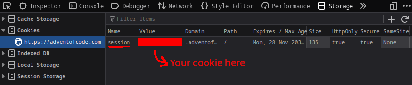

# aoc-ac

A very simple anti-cheat/cheater detector for Advent of Code private leaderboards.

## How to use

1. Get your AoC cookie by going to https://adventofcode.com and logging in --> Open "Developer Tools" --> Storage --> Cookies --> Copy the value from "session" (Firefox)

2. Find the leaderboard ID of the leaderboard you want to analyse. This is just the number at the end of your private leaderboard URL. For example: https://adventofcode.com/2023/leaderboard/private/view/ {THIS IS YOUR ID}

3. Run the script and paste in both of these values

If you want, you can adjust the cheater detection thresholds in [aoc-ac.py](aoc-ac.py) to be stricter or more lenient by modifying "THRESHOLD" and "MAX_SUS_DAYS"
